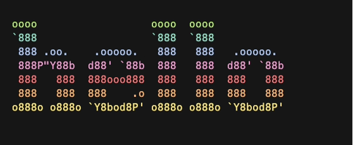
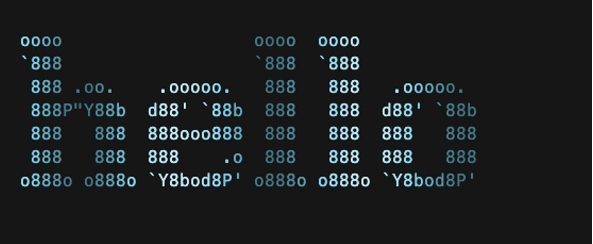
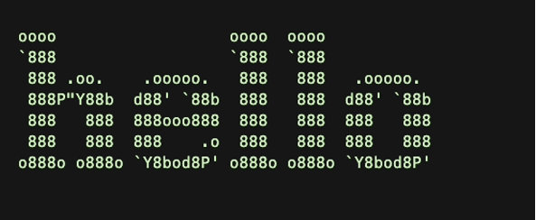
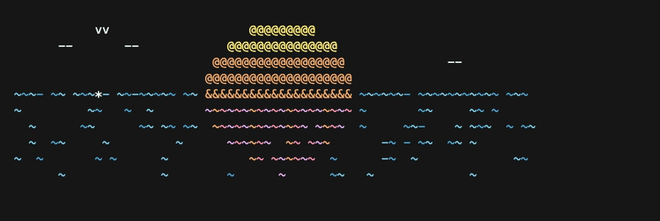
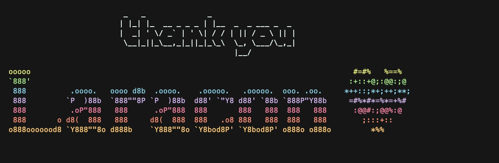
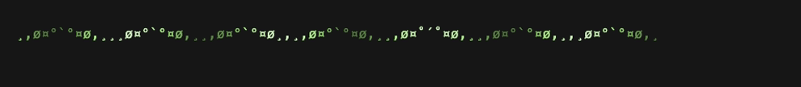

# Demos

Recorded with [VHS](https://github.com/charmbracelet/vhs). Every animation loops
until Ctrl-C; each gif holds a whole number of loops.

## figlet_text

Any text through figlet, with the color sweeping down the letters:

```sh
./animate figlet_text "hello" --color rainbow --style wave
```



The same text with the sweep running left to right instead:

```sh
./animate figlet_text "hello" --color cyan --style wave-h
```



A single color pulsing the whole block in unison, brightening and dimming in
hues of itself rather than changing hue:

```sh
./animate figlet_text "hello" --color green --style pulse --speed slow
```



## sunset_gradient

Flapping birds, moving waves, and twinkling water:

```sh
./animate sunset_gradient
```



## thankyou_gradient

A gradient scrolling down the lettering, with the heart's fill texture riding
the same wave:

```sh
./animate thankyou_gradient
```



## divider_gradient

A crest of light travelling along the divider:

```sh
./animate divider_gradient divider_green.txt
```


